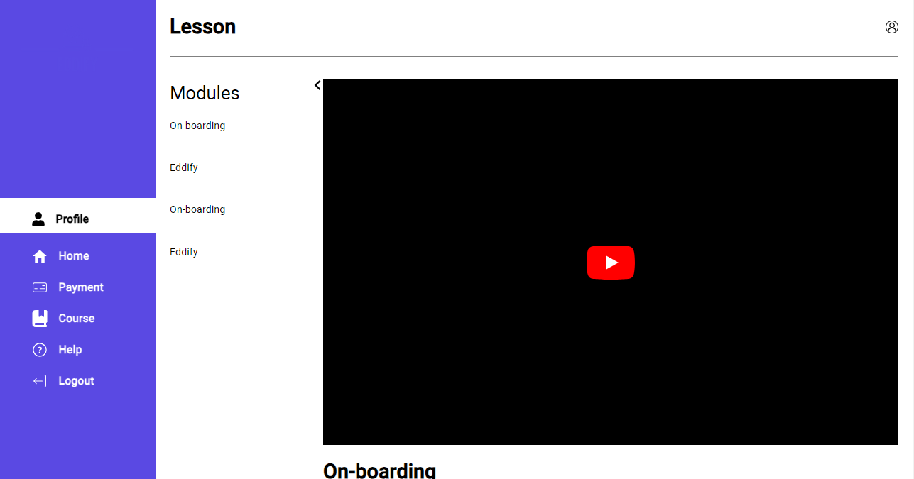

# Eddify

## 🚩 Table of Contents

- [Introduction](#-Introduction)
- [Installation](#-Installation)
- [Usage](#-Usage)
- [Contributing](#-Contributing)
- [Related Projects](#-Related Projects)
- [Used By](#-used-by)
- [License](#-license)

## Introduction 

Introduction
E-Learn Hub is an innovative e-learning platform designed to facilitate seamless online education experiences. It provides a user-friendly interface for both instructors and students to engage in interactive learning activities. With features like real-time collaboration, multimedia content integration, and progress tracking, E-Learn Hub aims to revolutionize the way education is delivered in the digital age.

## 📦  Installation

Install Dependencies.\
### `npm install`
followed by
### `npm start` 
to launch project

Deployed to Render Host
Clone the repository from GitHub:
 [https://eddify-frontend.onrender.com](https://github.com/okekolawolesunday009/Eddify_Frontend) to view it in your browser.
Final Project Blog Article ([blog post Eddify](https://medium.com/@kasshymoni0812/announcing-eddify1-0-f22a8a8d7c0a))

## 🤖 Usage
Once the application is running, users can perform the following actions:

* **Sign Up**: Create a new account as a student or instructor.
* **Login**: Access the platform using existing credentials.
* **Browse Course**: Discover a wide range of courses offered by various instructors.
* **Enroll in Courses**: Enroll in courses of interest.
* **Access Course Content**: Access lectures, quizzes, and other course materials.
* **Interact with Instructors**: Engage in discussions and ask questions.
* **Track Progress**: Monitor progress through course completion tracking.

## Contributing

This section has moved here: [https://facebook.github.io/create-react-app/docs/making-a-progressive-web-app](https://facebook.github.io/create-react-app/docs/making-a-progressive-web-app)

## Related Projects

* **OpenEdu**: - An open-source platform for collaborative online learning.[OpenEdu](https://joint-research-centre.ec.europa.eu/what-open-education/openedu-framework-and-guidelines_en)

* **Learnify**- A learning management system designed for educational institutions.(https://facebook.github.io/create-react-app/docs/deployment)
[learnify](https://learnify.co.za/)

## Licences

 [https://eddify-frontend.onrender.com](https://github.com/okekolawolesunday009/Eddify_Frontend) 

## Authors

Author(s): Oke Kolawole, Timilehin Adeniran
Oke Kolawole's LinkedIn ([Link to Oke Kolawole's LinkedIn profile](https://github.com/okekolawolesunday009))
Timilehin Adeniran's LinkedIn profile](https://github.com/timishot/EDDIFY))

